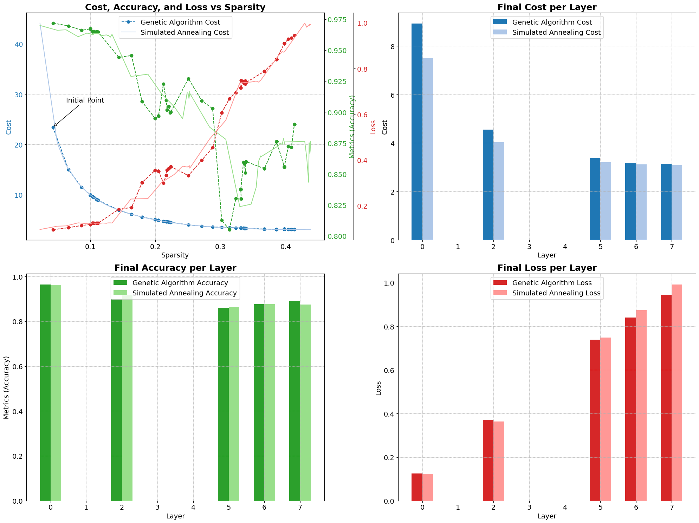
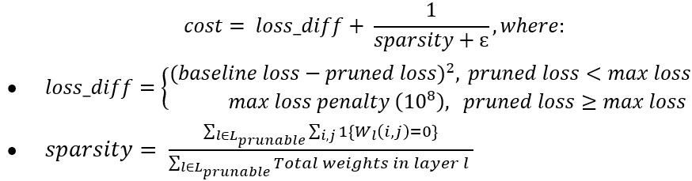
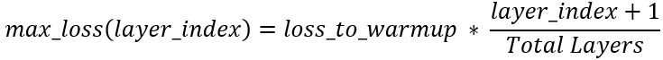
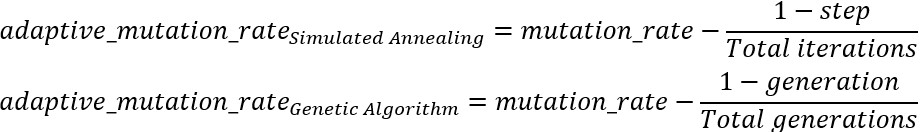
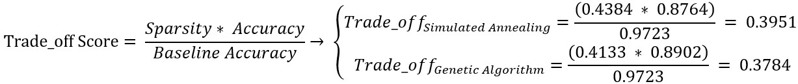

# Unstructured Local Search Pruning

This project focuses on the application and evaluation of 2 **local search** optimization techniques, **Simulated Annealing** and **Genetic Algorithm**, to solve the problem of **Neural Network pruning**. Its primary objective was to reduce model complexity and enhance computational efficiency without significantly compromising performance. 

👉 Check the [source.ipynb](./source.ipynb) and [report.pdf](./report.pdf) for the full implementation details.

## I. Solution Design Overview

Pruning is a crucial technique in Deep Learning model optimization, as it reduces the number of weights, leading to smaller model sizes, faster inference times, and lower memory usage. Traditional pruning techniques rely on predefined rules or assumptions about which weights to prune. This project will **bypass** these limitations by leveraging local search algorithms to dynamically learn the best pruning masks. 

### 1. Techniques Used

**Simulated Annealing** and **Genetic Algorithm** were experimented here to solve this optimization problem. They will be used as a means of automatically discovering best pruning masks that eliminate unnecessary weights without making any rule-based assumptions regarding weight importance:
-	**Simulated Annealing** (`SA`): A probabilistic local search method inspired by the physics of annealing in metallurgy, which explores the pruning mask space by accepting suboptimal solutions at higher *temperatures* to escape local minima, gradually refining the solution as the *temperatures* cools. By gradually lowering this *temperatures*, it controls the probability of accepting worse solutions as the algorithm refines its pruning masks. 
-	**Genetic Algorithm** (`GA`): An **evolutionary** algorithm simulating evolutionary processes such as natural *selection*, *crossover*, and *mutation*. It maintains a *population* of possible candidate pruning solutions (`chromosomes`) and evolves them over several *generations* to discover optimal pruning masks. `GA` is particularly effective at exploring a larger solution space due to its population-based nature, allowing for more aggressive pruning strategies.

### 2. Objective Function

This function evaluates the costs of pruning masks based on 2 key criteria: 
- **Loss difference**: The performance degradation of the pruned model compared to the original model 
- **Effective sparsity**: The level of sparsity achieved in each layer, along with a small epsilon to avoid division by 0.

This formulation encouraged the algorithm to find a balance between minimizing loss and maximizing sparsity, with a high penalty for excessive loss (exceed the `max_loss`). The loss difference (`loss_diff`) is also squared to penalize high loss more than low loss.

### 3. Layer-wise with Adaptive Terms

A unique feature in my implementation is the **layer-wise** evolution strategy, which allows for focused optimization of **each layer's pruning mask**. Both techniques are applied sequentially to each layer with a novel **warmup** strategy for adaptive maximum allowable loss threshold that gradually increases as progressing through the layers:

This approach allows for more aggressive pruning in the earlier layers while being more conservative in deeper layers, which are typically more sensitive to pruning. Both techniques are also applied with `adaptive_mutation_rate` to enhance their effectiveness over time:

These adaptive rates allow for broader exploration in early stages and finer tuning towards the end, contributing to the algorithms' ability to find good pruning configurations.

### 4. Ensure Fair Experiment

The experiment was conducted in **Colab PRO** using [TensorFlow](https://www.tensorflow.org) and **LeNet** was used as the baseline architecture in this project. With a [layer-wise pruning strategy and adaptive parameters](#3-layer-wise-with-adaptive-terms), the goal of [2 above algorithms](#1-technique-used) is to effectively prune a **LeNet-5** model trained on the **MNIST** dataset, which achieved a baseline accuracy of **97.23%** with **61,470** weights. Moreover, to strengthen a fair comparison, I employed these following on purpose:
- Initial `mutation_rate` was set to **0.15**, meaning **15%** of the weights in the pruning mask could change at the start of the process. Each algorithm will calculate its adaptive version to fine-tune solutions over time.
- The number of pruning loops in each algorithm will be **1000** in totals:
  - Total loop(`SA`) = `iterations` * number of prunable layers = 200 * 5 = **1000**.
  - Total loop(`GA`) = `num_generations` * (`population_size` - `elite_size`) * number of prunable layers = 20 * (12 - 2) * 5 = **1000**.

## II. Major Findings

<table>
  <thead>
    <tr>
      <th align="center">Metrics</th>
      <th align="center">Simulated Annealing (SA)</th>
      <th align="center">Genetic Algorithm (GA)</th>
    </tr>
  </thead>
  <tbody>
    <tr>
      <td align="center">Baseline accuracy</td>
      <td align="center" colspan="2">97.23%</td>
    </tr>
    <tr>
      <td align="center">Final accuracy</td>
      <td align="center">87.44%</td>
      <td align="center"><b>89.02%</b></td>
    </tr>
    <tr>
      <td align="center">Initial loss</td>
      <td align="center">0.0959</td>
      <td align="center">0.0953</td>
    </tr>
    <tr>
      <td align="center">Final loss</td>
      <td align="center">0.9923</td>
      <td align="center"><b>0.9442</b></td>
    </tr>
    <tr>
      <td align="center">Sparsity gained</td>
      <td align="center"><b>0.4384</b></td>
      <td align="center">0.4133</td>
    </tr>
    <tr>
      <td align="center">Time taken</td>
      <td align="center"><b>11 mins 43 secs</b></td>
      <td align="center">27 mins 46 secs</td>
    </tr>
  </tbody>
</table>

1. **Pruning Effectiveness**: Both `SA` and `GA` demonstrated significant model compression while maintaining reasonable accuracy. SA achieves a final sparsity of **43.84%** with a **9.79%**-point drop in accuracy, while GA reaches **41.33%** sparsity with **8.21%**-point drop. To quantify this trade-off, I use the following simple metric:

    

    - `SA` achieves a slightly better trade-off score, indicating that it may be more effective at balancing sparsity and accuracy. 
    - However, the difference is marginal, and both techniques prove effective for the task. They maintain a reasonable balance between pruning aggressiveness (increased sparsity) and maintaining accuracy/loss. 

2. **Efficiency**: `SA` proved to be faster than `GA`, requiring less than half the execution time. It completed the pruning process in **11 mins 43 secs**, whereas `GA` required **27 mins 46 secs**. This makes `SA` more suitable for applications where time efficiency is critical.
3. **Convergence Behaviour**: `SA` exhibited rapid initial improvement, particularly beneficial for quick results, while `GA` showed more gradual, steady improvements across generations.

👉 Check the [source.ipynb](./source.ipynb) and [report.pdf](./report.pdf) for more experiment details and comparison.